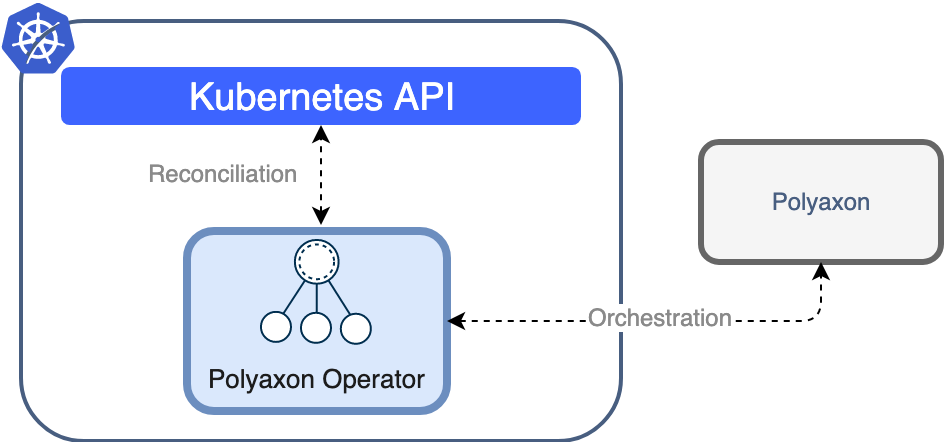

# Polyaxon Operator & Controller for Kubernetes

## Introduction

Kubernetes offers the facility of extending it's API through the concept of 'Operators' ([Introducing Operators: Putting Operational Knowledge into Software](https://coreos.com/blog/introducing-operators.html)). This repository contains the resources and code to deploy an Polyaxon native CRDs using a native Operator for Kubernetes.

This project is a Kubernetes controller that manages and watches Customer Resource Definitions (CRDs) that define primitives to handle Polyaxon's builds, jobs, experiments, notebooks, tensorboards, kubeflow integrations, ...

