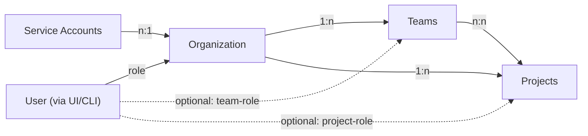

# Role-Based Access Controls in Polyaxon

The role-based access control (RBAC) in Polyaxon is based on users, organizations, teams, projects, and roles:

- `Users` are [authenticated](/docs/administration/authentication-and-sso) individuals who access Polyaxon.
- `Organizations` are the top-level entities that contain teams and projects.
- `Teams` group users within an organization for easier access management across projects.
- `Projects` group operations, experiments, and artifacts to allow for fine-grained role-based access control (RBAC).
- `Roles` define the permissions of users within an organization, team, or project:
  - By default, users get assigned a role on the organizational level.
  - For more fine-grained control, users can be assigned team-level or project-level roles.

`Service Accounts` and `API Tokens` are used to authenticate programmatic access to the Polyaxon API. Service accounts are scoped to an organization and can be assigned specific scopes.



## Access Organizations, Teams, and Projects

You can switch between organizations, teams, and projects using the navigation in the UI or via the CLI.

<LangTabs items={["UI", "CLI"]}>

<Tab>

{/*  */}

</Tab>

<Tab>

```bash
# Set default organization
polyaxon config set --org <organization>

# Set default team space
polyaxon config set --owner=<owner>/<team>

# Access a project (multiple formats)
polyaxon ops ls -p <project>
polyaxon ops ls -p <owner>/<project>
polyaxon ops ls -p <owner>/<team>/<project>

# Initialize a project in the current directory
polyaxon init <project>
```

</Tab>

</LangTabs>

## Roles and Scopes

- `Owner`: full permissions across the organization, including destructive operations like deleting the organization
- `Billing`: can manage subscription and billing details
- `Manager`: admin access on all teams, can add and remove members
- `Admin`: can manage teams and projects they are a member of, configure integrations and settings
- `Member`: can view and act on operations, submit runs, and manage project resources
- `Viewer`: read-only access to the organization and projects
- `Outsider`: no default access to the organization, to be used when user should have access to specific teams or projects only

import {
  Accordion,
  AccordionContent,
  AccordionItem,
  AccordionTrigger,
} from "@/components/ui/accordion";

export function RolePermissionTable({ roleScopes }) {
  return (
    <div className="grid grid-cols-5 gap-1">
      {Object.entries(roleScopes).map(([role, scopes]) => (
        <div key={role} className="flex flex-col">
          <div className="border-b pb-2 mb-2 border-gray-600">{role}</div>
          {scopes
            .sort((a, b) => a.localeCompare(b))
            .map((scope) => (
              <div key={scope} className="text-xs mt-1 break-words">
                {scope}
              </div>
            ))}
        </div>
      ))}
    </div>
  );
}

<Accordion type="single" collapsible>
  <AccordionItem value="organization-scopes">
    <AccordionTrigger>Organization-level scopes</AccordionTrigger>
    <AccordionContent className="overflow-x-auto">
      <RolePermissionTable
        roleScopes={{
          OWNER: [
            "org:admin",
            "org:write",
            "org:read",
            "org:restricted",
            "org:integrations",
            "org:reports",
            "member:admin",
            "member:write",
            "member:read",
          ],
          BILLING: [
            "org:admin",
            "org:write",
            "org:read",
            "org:integrations",
          ],
          MANAGER: [
            "org:write",
            "org:read",
            "org:restricted",
            "org:integrations",
            "org:reports",
            "member:admin",
            "member:write",
            "member:read",
          ],
          ADMIN: [
            "org:read",
            "org:integrations",
            "org:reports",
            "member:read",
          ],
          MEMBER: [
            "org:read",
            "member:read",
          ],
          VIEWER: [
            "org:read",
            "member:read",
          ],
          OUTSIDER: [
            "org:read",
            "member:read",
          ],
        }}
      />
    </AccordionContent>
  </AccordionItem>
  <AccordionItem value="team-scopes">
    <AccordionTrigger>Team-level scopes</AccordionTrigger>
    <AccordionContent className="overflow-x-auto">
      <RolePermissionTable
        roleScopes={{
          OWNER: [
            "team:admin",
            "team:write",
            "team:read",
          ],
          MANAGER: [
            "team:admin",
            "team:write",
            "team:read",
          ],
          ADMIN: [
            "team:admin",
            "team:write",
            "team:read",
          ],
          MEMBER: [
            "team:write",
            "team:read",
          ],
          VIEWER: [
            "team:read",
          ],
          OUTSIDER: [
            "team:read",
          ],
        }}
      />
    </AccordionContent>
  </AccordionItem>
  <AccordionItem value="project-scopes">
    <AccordionTrigger>Project-level scopes</AccordionTrigger>
    <AccordionContent className="overflow-x-auto">
      <RolePermissionTable
        roleScopes={{
          OWNER: [
            "project:admin",
            "project:write",
            "project:read",
            "project:integrations",
            "project:reports",
            "projectResource:admin",
            "projectResource:write",
            "projectResource:read",
          ],
          MANAGER: [
            "project:admin",
            "project:write",
            "project:read",
            "project:integrations",
            "project:reports",
            "projectResource:admin",
            "projectResource:write",
            "projectResource:read",
          ],
          ADMIN: [
            "project:admin",
            "project:write",
            "project:read",
            "project:integrations",
            "project:reports",
            "projectResource:admin",
            "projectResource:write",
            "projectResource:read",
          ],
          MEMBER: [
            "project:read",
            "project:reports",
            "projectResource:admin",
            "projectResource:write",
            "projectResource:read",
          ],
          VIEWER: [
            "project:read",
            "projectResource:read",
          ],
          OUTSIDER: [],
        }}
      />
    </AccordionContent>
  </AccordionItem>
</Accordion>

## Managing Users

### Add a new user to an organization

In the organization settings, you can invite users and assign them a role. Users can only assign roles that are lower or equal to their own role.

### Changing user roles

Any user with the `member:write` scope can change the role of a user in the organization settings. This will affect the user's permissions across all projects in the organization unless overridden by team-level or project-level roles.

## Managing Projects

### Add a new project

Any user with the `project:write` scope can create a new project within a Polyaxon organization.

### Transfer a project to another organization

Only users with the `org:admin` scope can transfer a project to another organization. This will remove the project from the current organization and add it to the new one. Access to the project will depend on the roles configured in the new organization.

During this process, no data will be lost. All project settings, operations, artifacts, and configurations will be transferred to the new organization. The project remains fully operational — settings (except for access management) and data will remain unchanged and associated with the project.

## Team-level roles

<AvailabilityBanner
  availability={{
    hobby: "not-available",
    core: "not-available",
    pro: "not-available",
    enterprise: "full",
    selfHosted: "ee",
  }}
/>

Teams allow you to group users and assign them shared access to a set of projects. When a user is part of a team, their team-level role can grant higher permissions than their organization-level role for projects assigned to that team.

If a team-level role provides a higher scope than the user's organization-level role, the higher role applies for projects linked to that team.

## Project-level roles

<AvailabilityBanner
  availability={{
    hobby: "not-available",
    core: "not-available",
    pro: "not-available",
    enterprise: "full",
    selfHosted: "ee",
  }}
/>

Users by default inherit the role of the organization they are part of. For more fine-grained control, you can assign a user a role on the project level. This is useful when you want to differentiate permissions for different projects within the same organization.

If a project-level role is assigned, it will override the organization-level role for that project.

If you want to give a user access to only certain projects within an organization, you can set their role to `Outsider` on the organization level and then assign them a role on the project level or through a team.

## GitHub Discussions

import { GhDiscussionsPreview } from "@/components/gh-discussions/GhDiscussionsPreview";

<GhDiscussionsPreview labels={["feat-rbac"]} />
