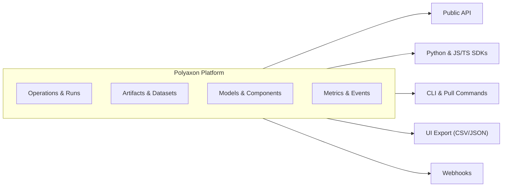

# CLI & API Refs

**Polyaxon is designed to be open, extensible, and flexible.** Teams using Polyaxon build custom workflows and integrations on top of the platform using the CLI, SDKs, API, exports, and webhooks.

Example use cases:

- Automate experiment submission and model promotion in CI/CD pipelines
- Build custom dashboards and reports on operation metrics and results
- Export and sync artifacts, models, and datasets to external systems
- Trigger external systems with webhooks on run lifecycle events
- Integrate with internal tools for scheduling, alerting, and monitoring

## Features

import {
  Globe,
  Code,
  Download,
  Terminal,
  Webhook,
} from "lucide-react";

<Cards num={3}>
  <Card
    title="CLI"
    href="/docs/cli/overview"
    icon={<Terminal />}
    arrow
  />
  <Card
    title="Query via SDKs"
    href="/docs/query-language/query-via-sdk"
    icon={<Code />}
    arrow
  />
  <Card
    title="Export Options"
    href="/docs/cli/export-data"
    icon={<Download />}
    arrow
  />
  <Card
    title="Public API"
    href="/docs/api"
    icon={<Globe />}
    arrow
  />
  <Card
    title="Webhooks"
    href="/docs/webhooks"
    icon={<Webhook />}
    arrow
  />
</Cards>
