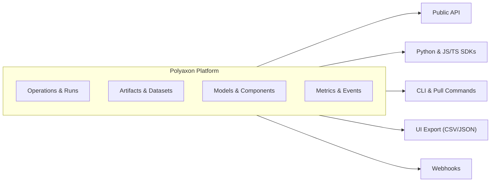

# CLI, SDKs & API Refs

**Polyaxon is designed to be open, extensible, and flexible.** Teams using Polyaxon build custom workflows and integrations on top of the platform using the CLI, SDKs, API, exports, and webhooks.

Example use cases:

- Automate experiment submission and model promotion in CI/CD pipelines
- Build custom dashboards and reports on operation metrics and results
- Export and sync artifacts, models, and datasets to external systems
- Trigger external systems with webhooks on run lifecycle events
- Integrate with internal tools for scheduling, alerting, and monitoring

## Features

import {
  Braces,
  Code,
  Code2,
  Download,
  FileCode2,
  Globe,
  KeyRound,
  Terminal,
  Webhook,
} from "lucide-react";

# References

Use these references when you need exact commands, schema fields, generated API docs, SDK methods, Helm values, or webhook payloads.

## Platform references

<Cards num={3}>
  <Card
    title="Polyaxonfile"
    href="/docs/polyaxonfile/overview"
    icon={<FileCode2 />}
    description="Manifest schema, specification sections, and runtime context."
    arrow
  />
  <Card
    title="CLI"
    href="/docs/cli/overview"
    icon={<Terminal />}
    description="Commands for authentication, projects, runs, artifacts, sandboxes, and automation."
    arrow
  />
  <Card
    title="Public API"
    href="/docs/api"
    icon={<Globe />}
    description="REST endpoints, authentication, request bodies, and response schemas."
    arrow
  />
  <Card
    title="Query Language"
    href="/docs/query-language/overview"
    icon={<Braces />}
    description="Filters and expressions for runs, projects, artifacts lineage, and SDK queries."
    arrow
  />
  <Card
    title="Webhooks"
    href="/docs/webhooks"
    icon={<Webhook />}
    description="Webhook events and payloads for external automation."
    arrow
  />
  <Card
    title="Sandbox API"
    href="/docs/sandbox/client"
    icon={<KeyRound />}
    description="Client, filesystem, process, and PTY APIs for sandbox sessions."
    arrow
  />
  <Card
    title="Export Options"
    href="/docs/cli/export-data"
    icon={<Download />}
    description="Export data from polyaxon."
    arrow
  />
</Cards>
