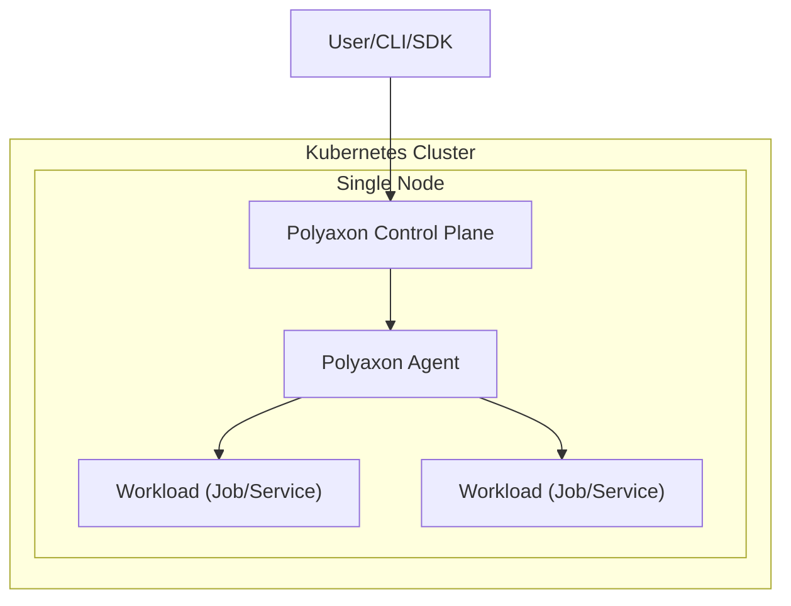
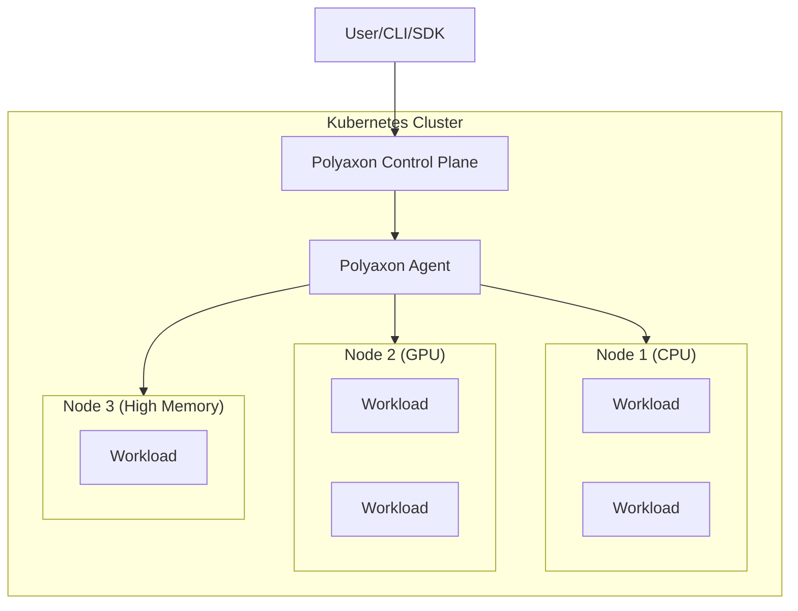
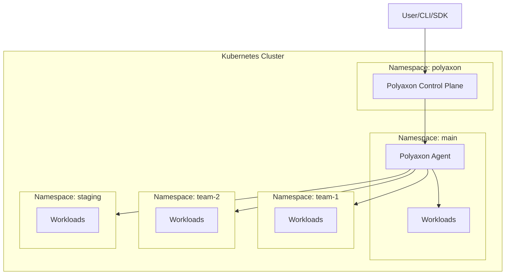
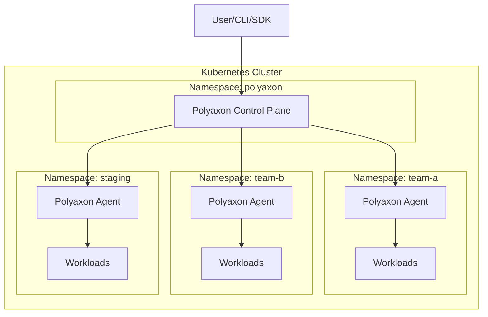
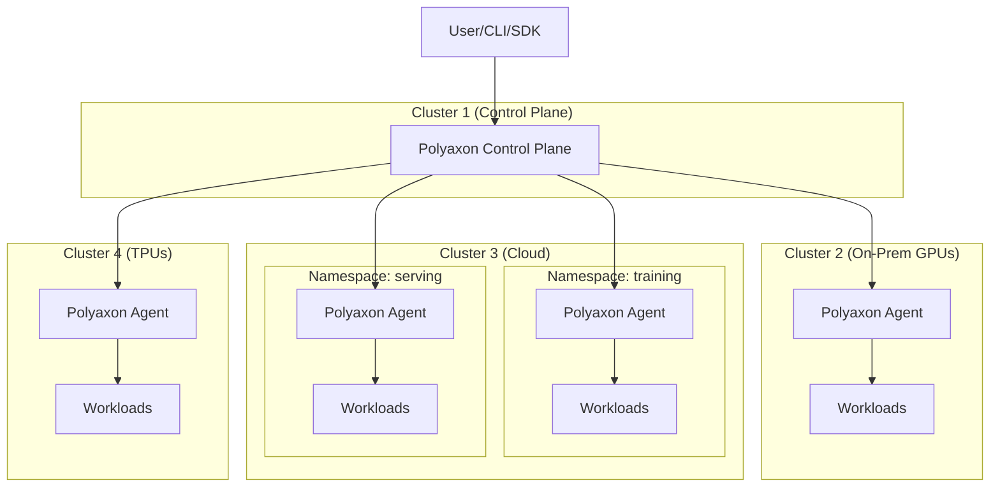

## Overview

Before we dive into the deployment setups, it's important to define some use-cases that might change the complexity of your deployment.

It's often recommended to start with the simplest deployment option possible, and only change that when you need to scale or if you are facing a compliance requirement.

We oftentimes see teams deploy complex Polyaxon setups when they have one of these use-cases:
 * Isolation
 * Replication

### Isolation

Isolation is the process of defining boundaries to separate and manage access.

Isolation can be used to:

  * Establish some processes and to separate dev/staging/production environments.
  * Isolate projects, datasets access, models, and other artifacts.
  * Authorize users and teams with different access to different environments.
  * Isolate and partition customer data.
  * All.

### Replication

Replication is the process of deploying the same configuration on different environments.

Replication can be used to deploy similar configuration several times to:

  * Partition and define landscapes on dev/staging/production environments.
  * Scale workload on different compute resources (on-prem, cloud clusters for extra GPUs, or different resources e.g. TPUs)
  * All.

## Setups

Both isolation and replication can be achieved by creating:

  * Multiple namespaces.
  * Multiple clusters.
  * All.

To manage multiple namespaces and/or multiple clusters you need to have a subscription to Polyaxon Cloud or Polyaxon EE.

## Strategies

In the following section we will go over several deployment options:

### Single node deployment

This is the simplest deployment strategy possible, it consists of deploying Polyaxon to a single Kubernetes cluster with one single node.
This deployment strategy is mostly used for trying out Polyaxon Community Edition on a user's laptop with [minikube](https://github.com/kubernetes/minikube) or [microk8s](https://microk8s.io/).

> If you are using Polyaxon cloud or Polyaxon EE, you can also turn your local laptop into a worker node using Polyaxon Agent.
> By deploying Polyaxon agents to your laptop and your team members' laptops, you can use those agents for
> testing and running operations using your local GPU resources in case the main cluster is busy.

### Multi nodes deployment

This is also a simple deployment option, and is generally enough for several teams.
Polyaxon can deploy to any cluster and has no restrictions on the number of nodes, even for the open-source version.

Users can still leverage node management and scheduling to deploy and schedule different workloads on different node types.

### Multi-namespace deployment

When you need to manage multiple namespaces, you can choose between two approaches depending on your isolation requirements.

#### Single agent managing multiple namespaces

In this setup, a single Polyaxon Agent is deployed alongside the control plane and is configured to manage workloads across multiple namespaces.
This is simpler to operate since there is only one agent to maintain, but it requires the agent to have access to all target namespaces.

#### Dedicated agent per namespace

In this setup, each namespace gets its own Polyaxon Agent deployment. The control plane is deployed separately and manages all agents through their queues.
Each agent only has access to its own namespace, providing stronger isolation boundaries. The control plane has no direct access to the other namespaces or the configurations they are using.

Each Agent deployment, on the different namespaces, can also take advantage of node scheduling.

### Multi-cluster deployment

Similar to multi-namespace deployment, when you need to manage multiple clusters, and possibly multiple namespaces on different clusters,
you need to deploy Polyaxon control plane separately from Polyaxon Agent deployments.

The control plane, in that case, will have no access to the other clusters and namespaces or the configurations they are using,
it will only manage the agents and their queues, and the agent deployments will be responsible for managing their respective namespaces in the clusters they are deployed in.

Each Agent deployment, on the different namespaces, can also take advantage of node scheduling.

## Scale

With these different deployment strategies you can achieve several setups for isolation, replication, and scale.

Polyaxon offers solutions that adapt with your need and requirements, and you can achieve massive scale:

 * The control plane can easily scale horizontally using replicas for the API and the scheduler, and you can deploy Celery with a rabbitmq/redis as broker.
 * The agents can be deployed on as many Kubernetes clusters that you need or have access to.
 * You can use one or more artifacts stores of your choice to store unlimited artifacts and access large datasets.
 * You can define complex [scheduling and routing strategies](/docs/scheduling/scheduling-strategies/).
 * You can scale and automate your workflows using [distributed jobs](/docs/workload/distributed/), [parallel executions, dags and workflows, and hyperparameter tuning](/docs/orchestration/).
 * You can gain unparalleled collaboration, agility, and speed using the [workload](/docs/workload/) and [administration](/docs/administration/) tools

## Choosing the Right Strategy

| Factor                  | Single Node              | Multi Nodes                        | Multi-Namespace                          | Multi-Cluster                             |
| ----------------------- | ------------------------ | ---------------------------------- | ---------------------------------------- | ----------------------------------------- |
| **Complexity**          | Minimal                  | Low                                | Medium                                   | High                                      |
| **Isolation**           | None                     | Node-level scheduling              | Namespace-level separation               | Full cluster-level isolation              |
| **Scalability**         | Limited to one node      | Scales with node pool              | Scales across namespaces                 | Scales across clusters and clouds         |
| **Use Case**            | Local dev and evaluation | Single team or small organization  | Multiple teams or environments           | Multi-cloud, hybrid, or regulated setups  |
| **License Required**    | No (CE)                  | No (CE)                            | Yes (Cloud/EE)                           | Yes (Cloud/EE)                            |

### General Recommendation

Start with the simplest deployment strategy that meets your needs. A single cluster with multiple nodes is sufficient for most teams. Move to multi-namespace or multi-cluster setups only when you need stronger isolation, compliance guarantees, or access to diverse compute resources across environments.

Please [reach out](/support) in case you have any questions on how to best architect your Polyaxon deployment.
